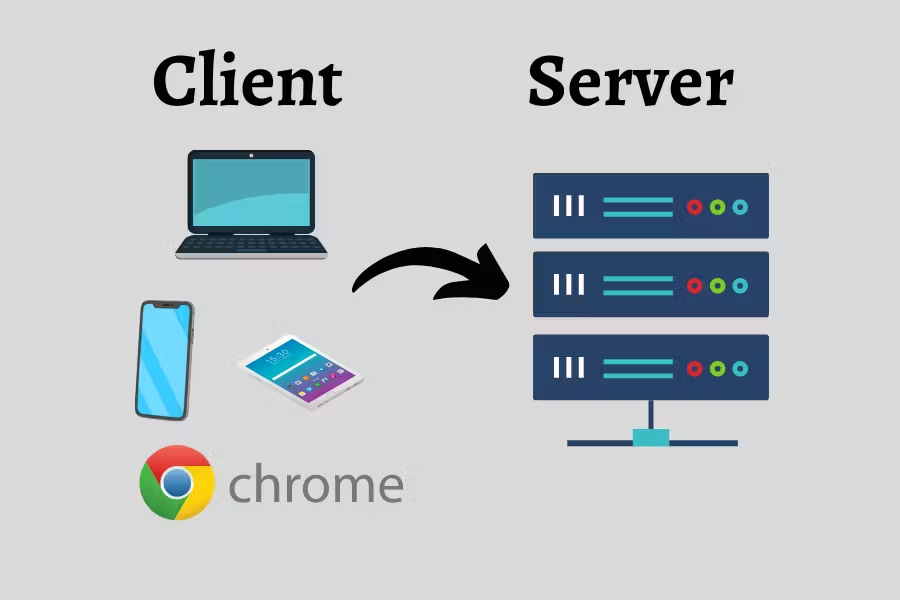
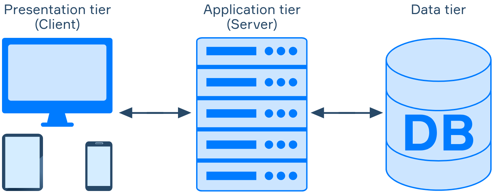

# Client-Server Model

The **Client-Server Model** is a foundational concept in networking and computing where a server provides resources or services, and a client requests them. This model underpins many modern systems, including the web, email, and databases.

---

## 1. What is a Client?

- A **Client** is a machine or process that requests data or a service from a server.
- In a web environment, the client is typically a web browser that requests HTML pages from a web server.
- **Example:** When you type a URL in your browser, your browser (client) sends a request to the server hosting the website to fetch and display the content.

### Key Characteristics:
- Clients are often end-user devices like computers, smartphones, or applications that interact with servers over a network.
- Clients initiate communication; they are not programmed to provide services to other clients or servers.

---

## 2. What is a Server?

- A **Server** is a machine or process that provides data or services to clients, often by listening for incoming network requests.
- **Example:** A web server responds to HTTP requests, providing HTML files or resources requested by a client.

### Key Characteristics:
- Servers are typically centralized machines that provide resources to multiple clients.
- Servers respond to client requests and often run in the background to be available whenever needed.

---

## 3. The Client-Server Model

- The **Client-Server Model** is the architecture design pattern that enables communication between clients and servers.
- In this model:
  - **Clients** request services, resources, or data.
  - **Servers** provide responses based on those requests.
- This model allows for **scalability** and **resource sharing**, as multiple clients can connect to a single server.

### Advantages:
- **Centralized resources** make maintenance easier.
- **Scalability** – Servers can serve many clients.
- **Security** – Servers can control and restrict access to data or services.

### Disadvantages:
- **Server overload** – Heavy traffic can slow down or crash the server.
- **Single point of failure** – If the server is down, clients lose access.

---

## 4. Examples of Client-Server Model in Real Life

### Web Browsing
- When a user types a URL in a browser (client), a request is sent to the server hosting the website.
- The server then sends back the requested HTML page or files, which the browser displays.

### Email
- **Clients** are email applications like Outlook, Gmail, or Apple Mail.
- **Servers** store, send, and receive emails, handling requests from email clients.

### Databases
- Database systems follow a client-server model, where **clients** (applications) query the database **server** to retrieve or store information.

---

## 5. Client and Server on the Same Machine

- **Example:** A computer may serve as a **web server** for external clients while simultaneously acting as a **client** by requesting data from a remote **database server**.

---

## 6. 3-Tier Architecture

The **3-Tier Architecture** is a software design pattern that divides an application into three distinct layers:
1. **Presentation Tier (Client)**
2. **Application Tier (Business Logic)**
3. **Data Tier (Database)**

### 1. Presentation Tier
- This layer is also known as the **Client Tier** and is responsible for displaying information to the user and collecting input.
- It consists of user interface components, such as web browsers, desktop applications, or mobile apps.
- The Presentation Tier communicates with the Application Tier, sending requests and receiving responses.

### 2. Application Tier
- Also known as the **Business Logic Tier**, this layer processes data received from the Presentation Tier.
- It contains the business logic, rules, and functions that define how data should be processed and managed.
- The Application Tier often acts as an intermediary between the Presentation Tier and Data Tier.

### 3. Data Tier
- The **Data Tier** consists of databases and data storage systems.
- This layer is responsible for storing, retrieving, and managing data required by the application.
- The Application Tier communicates directly with the Data Tier, sending queries and receiving results.

### Advantages of 3-Tier Architecture
- **Separation of Concerns**: Each layer has a specific role, making the application more organized and maintainable.
- **Scalability**: Each layer can be scaled independently based on demand.
- **Flexibility**: Changes in one layer do not impact the others directly, making it easier to update or modify components.

