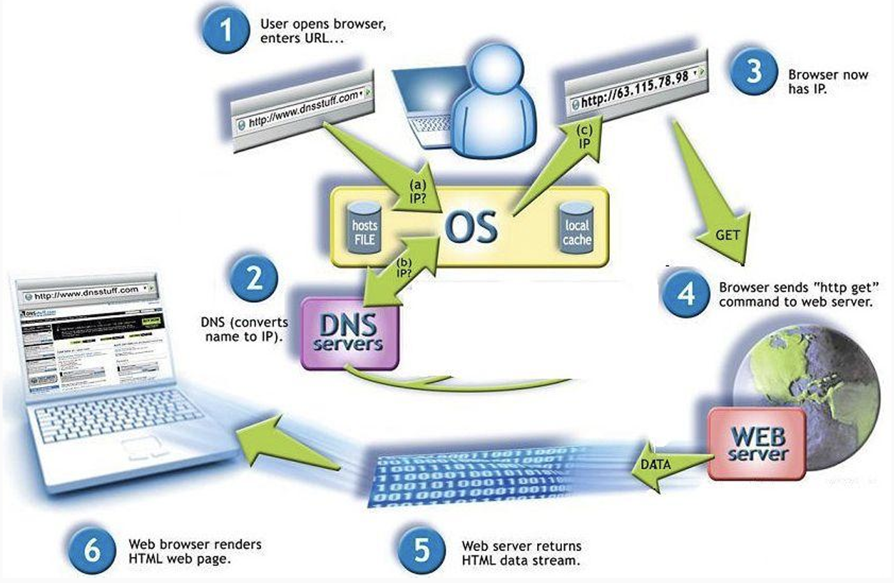

# Request Life Cycle

The **Request Life Cycle** outlines the stages a client request follows from the moment it is initiated until a response is received. Understanding this cycle is crucial for building efficient, scalable, and responsive applications.

---

## 1. Client Request Initiation
- The request life cycle starts when a client (such as a web browser or application) initiates a request. This can happen by typing a URL, clicking a link, submitting a form, or interacting with a user interface element.
- The client formulates the request, specifying details like the request type (GET, POST, etc.) and any data or parameters needed.

## 2. DNS Resolution
- Before the client can contact the server, it needs to resolve the domain name (e.g., www.example.com) to an IP address.
  - This is handled by the Domain Name System (DNS), which translates human-readable domain names into IP addresses that locate the server on the internet.
- If the IP address is not already cached by the client’s system, a DNS query is sent to the DNS server, which responds with the IP address for the requested domain.

## 3. Establishing a Connection
- With the server's IP address obtained, the client initiates a connection, often using the **TCP** (Transmission Control Protocol) protocol for reliable data transfer.
- For web applications, this connection is typically over **HTTP** or **HTTPS** (if secure).
  - **HTTPS** uses SSL/TLS encryption, ensuring data is securely transmitted by establishing a secure handshake between client and server.
- Once the connection is established, data packets can be transmitted back and forth over this connection.

## 4. Sending the Request
- The client sends an **HTTP request** to the server. This request includes:
  - **HTTP method** (e.g., GET, POST, PUT, DELETE) that specifies the action required.
  - **Headers** that convey metadata (e.g., content type, authentication).
  - An **optional body** (for methods like POST), carrying data such as form fields, JSON payloads, or files.
- The request format conforms to the HTTP protocol, ensuring the server can correctly interpret and process it.

### 4.1. Processing the Request (Server-Side)
- Upon receiving the request, the server parses it, extracting the method, headers, and any parameters or data.
- The server’s **application logic** determines how to handle the request based on the routing and middleware setup.
  - Middleware components (e.g., authentication, logging) may preprocess the request before the core application logic takes over.

### 4.2. Accessing the Database (if needed)
- If the request requires data (e.g., fetching user details, or saving form data), the server accesses its **database** or **data storage system**.
  - The server sends a query to the database, which then retrieves or updates the necessary information.
- Efficient querying and data handling are crucial at this stage to avoid delays in the response.

## 5. Generating the Response
- The server processes any data retrieved from the database or other sources and constructs a response.
- The response includes:
  - **Status code** (e.g., 200 for success, 404 for not found, 500 for server error) that indicates the outcome of the request.
  - **Headers** that provide metadata (e.g., content type, cache control).
  - **Body** containing the requested data, often in HTML, JSON, XML, or another format the client expects.
- This response is then serialized into the HTTP response format.

### 5.1. Sending the Response
- The server transmits the HTTP response back to the client over the established connection.
- Response time is crucial here for user experience, so the server may employ caching or compress data to optimize delivery.

## 6. Client Receives and Renders the Response
- The client receives the server’s response and interprets it.
  - For web browsers, HTML, CSS, and JavaScript content are rendered to display the requested page or update content dynamically.
  - For applications, the data is often parsed and processed further within the app.
- If the response is an error, the client may display an error message or take alternative action.

### 6.1. Connection Closure
- If the interaction is complete, the server closes the connection, freeing up resources.
  - In HTTP/1.1 and newer, **persistent connections** may remain open briefly for additional requests.
- The client can initiate another request if needed, or the cycle ends.

---

