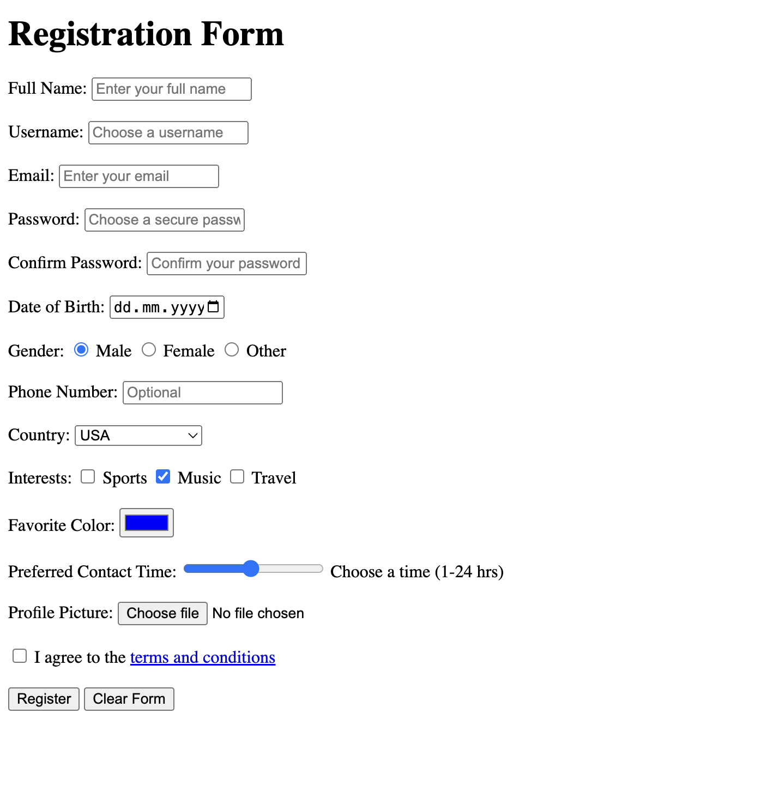

# Form elements Lab

Please reproduce in HTML the following table in index.html file from the current folder: 


# Details

## Requirements
Your registration form should include the following elements and attributes:

1. **Full Name**: A text input field with the following:
   - `placeholder` text ("Enter your full name").
   - `maxlength` attribute set to limit characters.
   - `required` attribute to make it mandatory.

2. **Username**: A unique text input field with a `placeholder` and `maxlength` attributes.

3. **Email**: An email input field that:
   - Validates for proper email format.
   - Includes `placeholder` and `required` attributes.

4. **Password** and **Confirm Password**:
   - Two password fields with `minlength` set to at least 8 characters.
   - Each field should have a `placeholder` and `required` attribute.

5. **Date of Birth**: A date picker input field with:
   - A defined `min` and `max` date range for eligibility.
   - `required` attribute.

6. **Gender**: Radio buttons for gender selection that:
   - Use the same `name` attribute to group options.
   - Include `checked` on a default option.

7. **Phone Number** (Optional): A phone input field with:
   - A `pattern` attribute to validate a specific format.

8. **Country**: A dropdown (`select` element) with the following requirements:
   - Multiple options (`<option>` tags) with one default option set using `selected`.
   - The dropdown itself should have a `required` attribute.

9. **Interests**: Checkbox options for interests that:
   - Use individual checkboxes for multiple selections.
   - Include at least one pre-selected option using the `checked` attribute.

10. **Favorite Color**: A color picker input.

11. **Preferred Contact Time**: A range slider for selecting a contact time between 1 and 24 hours:
   - Set the `min`, `max`, and `step` values accordingly.

12. **Profile Picture**: A file upload field for image files only:
   - Use the `accept` attribute to restrict to images.

13. **Terms and Conditions**: A required checkbox that confirms the user agrees to terms:
   - Include a link for the terms and conditions.

14. **Submit** and **Reset** buttons:
   - The Submit button should be active by default.
   - The Reset button clears the entire form.

## Example Structure

The form should be structured using `<div>` elements to contain each label and input pair for better organization and readability. Here is a sample of how to organize one of the form sections:

```html
<div>
    <label for="fullname">Full Name:</label>
    <input type="text" id="fullname" name="fullname" placeholder="Enter your full name" required maxlength="50">
</div>
